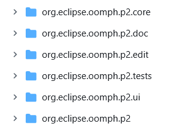

# Bundle Pools

* allows
  * | install many products & provision many target platforms, 
    * highly disk-space efficient
      * Reason: 🧠ALL share a COMMON bundle pool 🧠
        * -> 1! .jar | disk / EACH installable unit
    * improve performance
      * Reason: 🧠if an installable unit is | pool -> NEVER again needs to be downloaded 🧠
* uses
  * by Oomph's
    * `DocP2Task`
    * `DocTargletTask`
  * by ALL Eclipse's p2 technology 

---

* Oomph's technology layer | p2 / manage bundle pools
  * _Example:_ [here](https://github.com/eclipse-oomph/oomph/blob/8fedf1bdf2124ccad1ea74329fb642a8e72ebd34/plugins/org.eclipse.oomph.p2.core/src/org/eclipse/oomph/p2/core/Agent.java#L31-L39)
  * [Discussion](https://github.com/orgs/eclipse-oomph/discussions/137)
